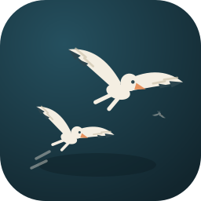

<p align="center">
  
</p>

# buds-watcher

Sony Inzone buds のイヤホンの切断、再接続を画面に通知するアプリ

# 機能

- イヤホンの切断、接続を画面に通知します
  - OS に搭載された通知機能は使用せず最前面に出すのでゲーム中などでも確認できます
  - 接続された際は通知にバッテリーの残量が表示されます
- メインウィンドウで現時点のバッテリー残量を確認できます
- Windows/Linux 対応
  - MacOS には現状対応していません
  - Linux で使用する際はセットアップが必要です(後述)

# 使い方

## Windows

1. [Releases](https://github.com/huequica/buds-watcher/releases) から最新の `buds-watcher.exe` をダウンロードする
2. `buds-watcher.exe` を実行
3. システムトレイにアイコンが表示されていれば　OK

## Linux

`libusb` を経由してアクセスしないといけないので `/dev/bus/usb/*/*` への読み書き権限も必要になります

### 1. USB 読み書き権限の設定

以下のファイルを作成してください

```
# /etc/udev/rules.d/99-inzone-buds.rules
SUBSYSTEM=="usb", ATTRS{idVendor}=="054c", ATTRS{idProduct}=="0ec2", MODE="0660", GROUP="input"
```

その後ユーザーを `input` グループに入れた後再起動 or `udevadm control --reload-rules && udevadm trigger` で設定を反映してください

### 2. アプリケーションの入手

好きな方法で入手してください

- [Releases](https://github.com/huequica/buds-watcher/releases) から最新の `buds-watcher` バイナリをダウンロードし、`chmod +x buds-watcher` で実行権限を付けて実行する
- Nix flakes を使っている場合: `nix run github:huequica/buds-watcher`、または flake input としてこのリポジトリを追加して `packages.<system>.default` を参照する
- リポジトリを clone してソースから実行する
  1. `nix develop` で DevShell に入る
     - nix を使用していなければこのステップは無視してください
     - direnv を併用していれば `direnv allow` で自動的に DevShell に入れます
  2. `uv sync` で依存を落とす
  3. `uv run poe app` で実行

システムトレイにアイコンが表示されていれば OK です

### Ubuntu などの GNOME 環境

GNOME は標準でシステムトレイ機能を廃止しているためこのままだとアイコンが表示されません  
GNOME Extensions から **"AppIndicator and KStatusNotifierItem Support"** を入れてください

### Wayland 環境

`wlr-layer-shell` プロトコルに対応していて KDE の `layer-shell-qt` がインストールされている環境(KDE Plasma など)では、X11 と同様に通知が正しく右上に固定表示されます  
それ以外の Wayland コンポジタ(GNOME など)や `layer-shell-qt` が無い環境では通知が画面中央に表示されますがバグではなく仕様です

<details>

<summary>なんでこんなことになっているか</summary>

Wayland はセキュリティ上の理由でクライアントがウィンドウの絶対位置を指定することを許可しておらず、通常のウィンドウはコンポジタ(KWin など)が決めたデフォルト位置、たいてい画面中央に表示されます  
正しく右上に固定するには `wlr-layer-shell` プロトコルへの対応が必要で、PySide6 用の公式バインディングはありませんが、KDE の `layer-shell-qt` プロジェクトが公式 QML モジュール(`org.kde.layershell`)を提供しているため、buds-watcher はそれが使える環境では QML ベースのオーバーレイを使い、使えない環境では従来のウィジェット版オーバーレイにフォールバックします

</details>
